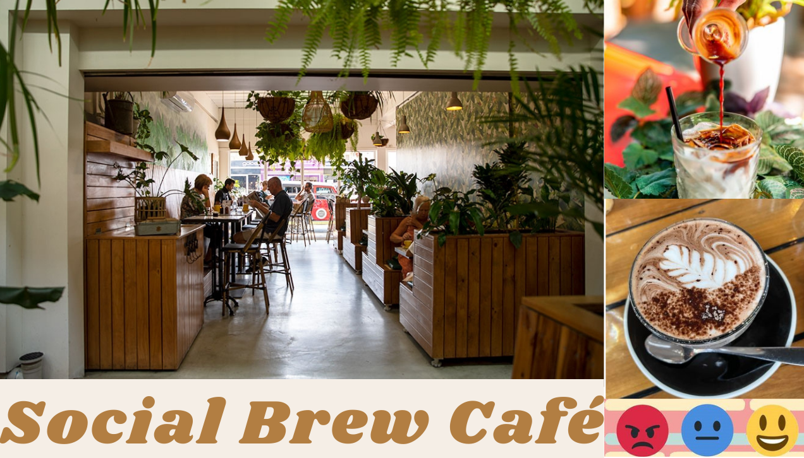

# Sentiment Analysis using BERT on Social Brew Café


(using BERT)

## Overview

This project utilizes the BERT (Bidirectional Encoder Representations from Transformers) model for sentiment analysis on the reviews provided by customers on the Social Brew Cafe-Pyrmont. BERT is a state-of-the-art natural language processing model that has demonstrated remarkable performance in various language understanding tasks.

### Research Paper
For a detailed understanding of the BERT model, please refer to the research paper:
- [BERT: Pre-training of Deep Bidirectional Transformers for Language Understanding](https://arxiv.org/abs/1810.04805)

## Dependencies

Make sure to install the following libraries to run the project:

```bash
pip install transformers torch requests beautifulsoup4 numpy pandas
```


## Libraries used:
```python
from transformers import AutoTokenizer, AutoModelForSequenceClassification
import torch
import requests
from bs4 import BeautifulSoup
import re

import numpy as np
import pandas as pd
```

## Collecting Reviews

Reviews are collected from the Yelp page: 
- [ Social Brew Cafe - Pyrmont.](https://www.yelp.com/biz/social-brew-cafe-pyrmont) These reviews are loaded into a dataframe, and each sentence is evaluated on a scale of 1-5 using the BERT model, where 1 is the minimum and 5 is the maximum.

